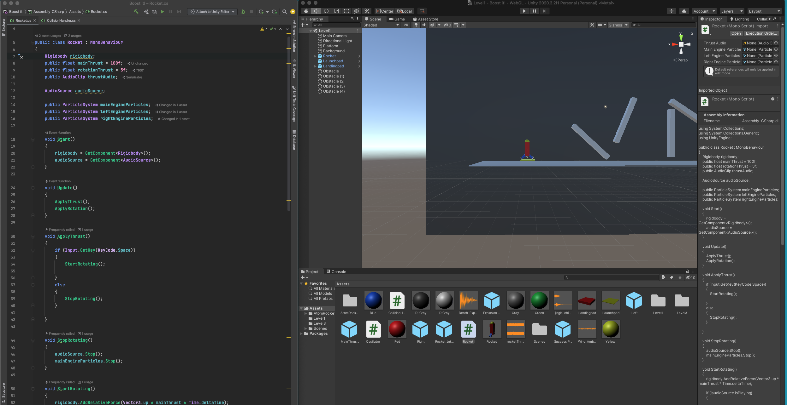



##### Project GAME: Design and Development of a Unity 3D based middle school CS curriculum

###### Mete Akcaoglu, Ph.D. | Selcuk Dogan, Ph.D. | Chuck Hodges, Ph.D. | Andrew Allen, Ph.D.

###### Georgia Southern University

###### NSF **2027948**



- - -

### Why game design?

* Game design is fun and engaging/appealing for students (and teachers)
* It (can) target cognitive and motivational outcomes
* It can lead to future jobs 

- - -

### Why game design with Unity?

* Unity is an industry-standard software
* It is uses C# + and a Game-Development Engine
* Is a direct connection to real-life game development
* Block-based coding has limits

- - -

### Unity Workflow

- - -

#### Project GAME

- - -

- - -

- - -

- - -

##### Key Resources

* Project GAME Website
* Project GAME games (on Play.Unity)