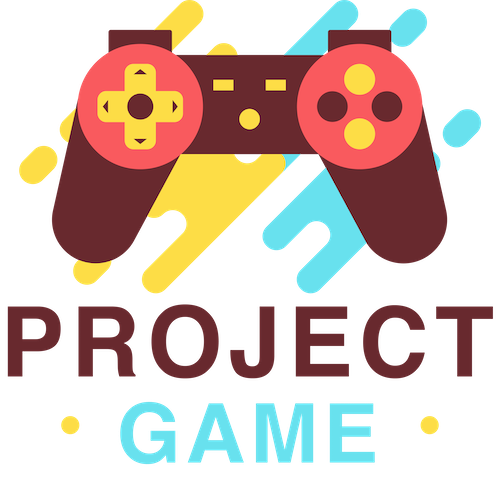

#### Project GAME: Design and Development of a Unity 3D based middle school CS curriculum

Mete Akcaoglu, Ph.D.

Selcuk Dogan, Ph.D.

Chuck Hodges, Ph.D.

Andrew Allen, Ph.D.

#### Georgia Southern University

- - -

Second Slide

- - -

Third Slide