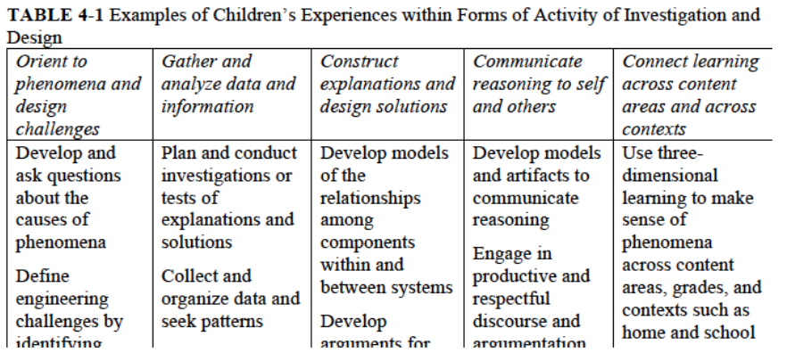
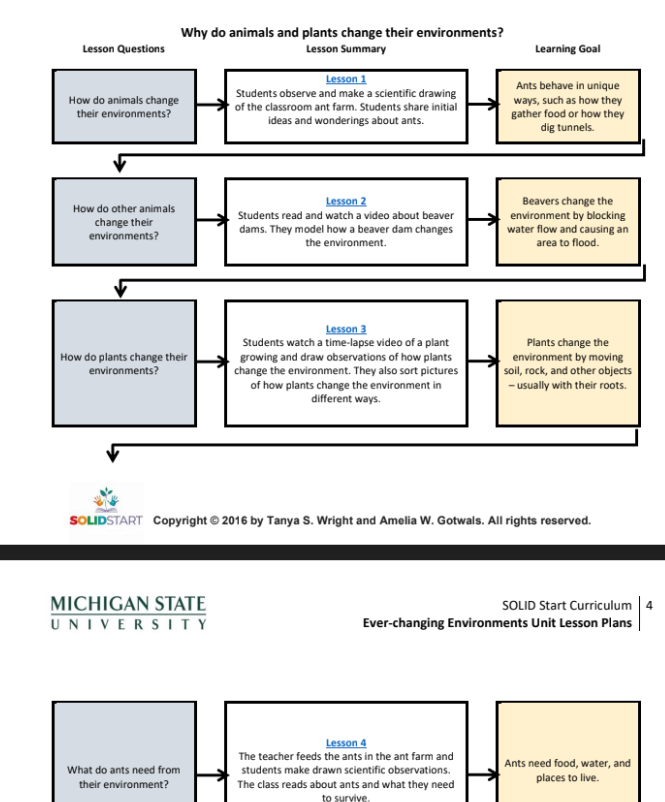
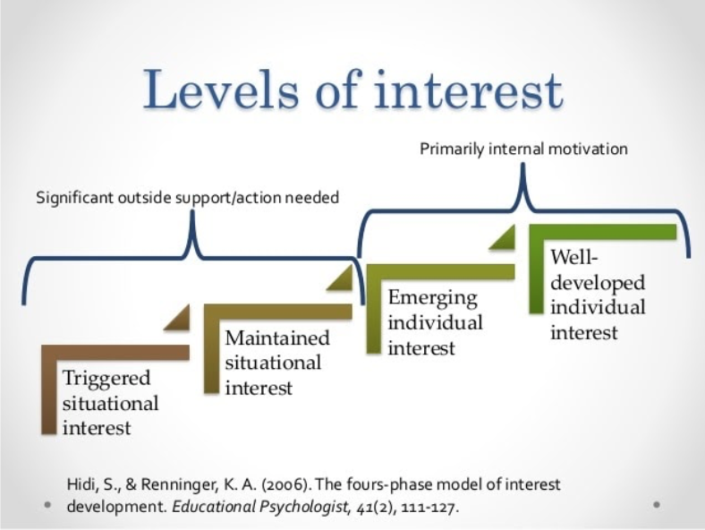
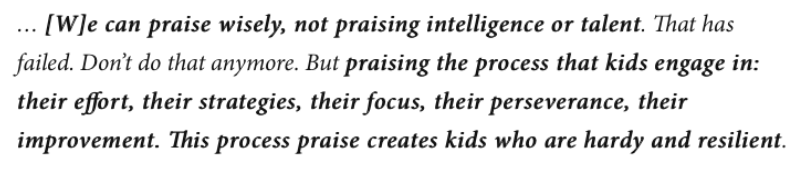
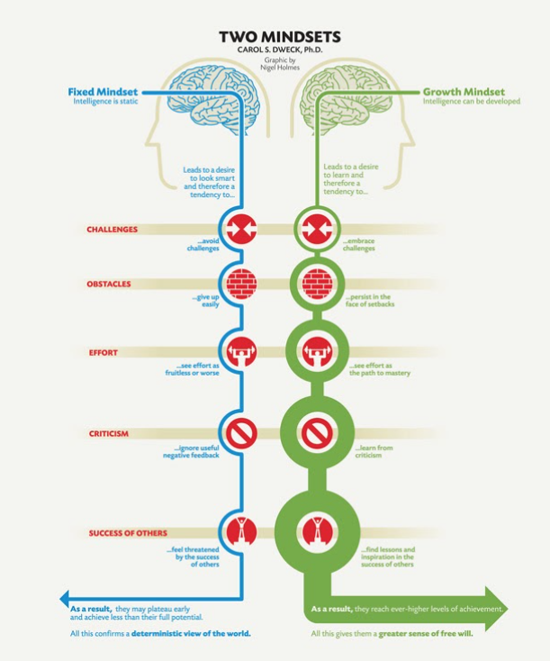
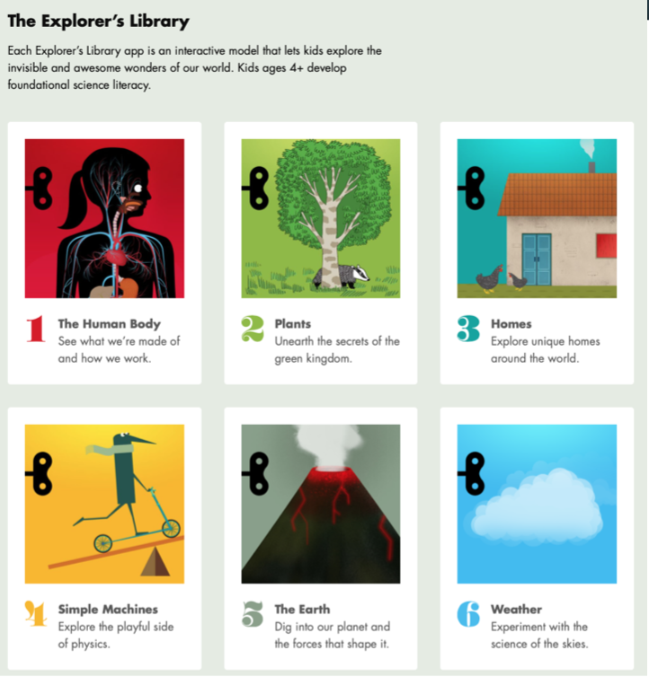

##### STEM and Problem Solving for the Little Ones

Mete Akcaoglu, Ph.D.

###### Georgia Southern University {style="color: gray"}

- - -

### STEM = Curiosity

* Children, even at very young ages, are deeply curious about the world around them and eager to investigate the many questions they have about their environment.
* Engaging them in learning science and engineering takes advantage of this interest and helps them to answer their own authentic questions and solve real-world problems that are important to them.
* Science Themes:
* * Weather
  * Pumpkins
  * Hot vs. Cold
  * Plants

`National Academies of Sciences, Engineering, and Medicine. 2021. Science and Engineering in Preschool Through Elementary Grades: The Brilliance of Children and the Strengths of Educators. Washington, DC: The National Academies Press.https://doi.org/10.17226/26215.`

- - -

### STEM Focused Learning

* Leverage children’s natural curiosity, give children opportunities for decision-making, sensemaking, and problem-solving, investigation.
* Engaging them in learning science and engineering takes advantage of this interest and helps them to answer their own authentic questions and solve real-world problems that are important to them.

- - -

### STEM Focused Learning

* Experiments - Data and Observations - Understanding phenomena
* Informal Settings Designed for STEM Learning: Science centers, zoos, botanical gardens, and natural history museums are all examples of designed, curated institutional settings that work both to elevate and celebrate various forms of scientific achievement and domination (Harraway, 1984), and to invite and support the public to explore science and engineering in self-directed ways (Falk and Storcksdeick, 2005).
* Place-Based Learning: Place-based science learning often emphasizes the connection between ecological and social systems.
* Digital Media and Online Learning: 
* * Digital simulations can also be used effectively to support preschool and elementary grade children’s learning, with appropriate scaffolding and support from teachers (Smetana and Bell, 2012)
  * Well-established robotics and programming initiatives and resources for preschool and elementary grade learners have demonstrated young children’s ability to design and solve engineering problems using computational strategies (Bers, González-González, and Armas-Torres, 2019),

- - -

#### **Investigation**

* Centering investigation and design in children’s classroom experiences from the earliest years helps them demonstrate and develop their proficiency in science and engineering.
* Developing empirical systems and gathering and analyzing data are central to science and engineering activity, including making decisions about what data to collect and about how to organize it to identify patterns.
* Scientific explanations strive to articulate causal mechanisms, to explain how or why something happens, and often support predictions about what might happen under specified conditions (Russ et al., 2008).
* Develop solutions and present.

- - -

#### Sample Curriculum - SOLID Start

* Link: <https://drive.google.com/drive/folders/1_B5OzCUolhjEG1Oo2SuBHQ2UbMSq6jcJ>
* 

- - -

- - -

#### STEAM and Beyond

* Integrating science and engineering with each other and with other content areas in preschool through elementary classrooms has the potential to enhance connections between subjects and effectively increase the amount of instructional time for science and engineering instruction.
* * Ready and Write about the Topic
  * Math about the topic (when possible)
  * Technology about the topic
  * Art about the topic
  * Curiosity, Engineering, and Science about the Topic 

- - -

##### Curriculum (full or partial)

* OLID
* Wee Engineer: <https://eiestore.com/wee-engineer-unit.html> (paid)

- - -

# BREAK - 5 mins

- - -

# **What does Educational Psychology Research Say about Learning?**

- - -

#### **Interest**

- - -

**Mindset: Fixed vs Growth**

* A fixed mindset is the belief that your intelligence, talents and other abilities are set in stone. You believe that you're born with a particular set of skills and that you can't change them.

  

  - - -

  

  - - -

  #### Guided Discovery Learning

  * Discovery learning puts to much burden on students
  * They cannot draw abstract conclusions or learn basic skills by just exploring
  * Provide guidance and necessary information rather than asking students to “freely explore”

- - -

#### **Technology**

* Technology can support: STEM + Curiosity + Discovery and Problem Solving
* Will show a couple of examples and then we can play a little :)

- - -

#### **Technology**

<https://tinybop.com>

- - -

#### **Technology**

[playosmo.com](playosmo.com)

- - -

<https://sphero.com>

- - -

<https://sphero.com>

- - -

# Let’s play