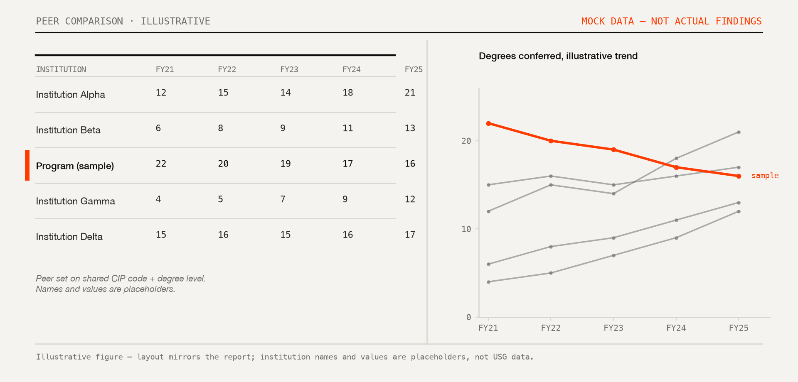

# Projects

[Selected tools, programs, and initiatives.]{.page-subtitle}

## Project GAME [NSF · $299,895 · 2020–2022]{.section-kicker}

*Developing and Piloting a Game Design-Based Computer Science Curriculum*

I designed, developed, and piloted a middle school computer science curriculum built around game design in Unity 3D, funded by an NSF CSforAll award (#2027948, $299,895). The curriculum trades block-based tools like Scratch for professional-grade ones, so students walk away with programming skills that transfer directly. Teachers in underserved rural schools across Southeast Georgia helped design and refine the materials with us.

- Four partner schools in Bulloch, Candler, Chatham, and Screven counties; six participating teachers
- Three research strands: curriculum design, teacher PD and professional learning communities, and implementation evaluation
- Builds on a decade of game-design-and-learning research (Akcaoglu & Koehler, 2014; Akcaoglu & Santos Green, 2018)

[Project website →](https://www.projectgame.org/) · [NSF award →](https://www.nsf.gov/awardsearch/showAward?AWD_ID=2027948)

**Selected publications:**

- Dogan, S. & Akcaoglu, M. (2024). How teachers from underrepresented schools experienced a blended professional development program on computer science and game-design. [*Teacher Education Quarterly, 51*(1), 76–103.](https://doi.org/10.1080/07380569.2023.2172987)
- Akcaoglu, M., Ozcan, M.S., & Dogan, S. (2023). What keeps teachers engaged during professional development? The role of interest development. [*Education Sciences, 13*(2), 188.](https://doi.org/10.3390/educsci13020188)
- Akcaoglu, M., Dogan, S., & Hodges, C.B. (2022). Real coding and real games: Design and development of a middle school curriculum using Unity 3D. [*TechTrends.*](https://doi.org/10.1007/s11528-022-00782-1)
- Akcaoglu, M., Rosenberg, J.M., Hodges, C.B., & Hilpert, J. (2021). An exploration of factors impacting middle school students' attitudes toward computer programming. [*Computers in the Schools, 38*(1).](https://doi.org/10.1080/07380569.2021.1882209)

## Game-Design and Learning (GDL) [2009–2022]{.section-kicker}

The foundational research line behind Project GAME. Starting with my dissertation at Michigan State, I spent a decade designing and studying after-school and in-class programs where students learn problem-solving, systems thinking, and computational thinking by designing their own digital games — first with Kodu and GameMaker, later with Unity 3D and C#.

- Originated as an after-school program studying cognitive outcomes of game design in middle schoolers
- Demonstrated transfer of problem-solving and systems-thinking skills through game-design tasks
- Extended into preservice teacher education through GDL workshops

**Key publications:**

- Akcaoglu, M. & Green, L.S. (2019). Teaching systems thinking through game design. [*ETR&D, 67*(1).](https://doi.org/10.1007/s11423-018-9596-8)
- Akcaoglu, M. & Kale, U. (2016). Teaching to teach (with) game design: Game design and learning workshops for preservice teachers. [*CITE, 16*(1), 60–81.](https://citejournal.org/volume-16/issue-1-16/general/teaching-to-teach-with-game-design-game-design-and-learning-workshops-for-preservice-teachers/)
- Akcaoglu, M. (2016). Design and implementation of the Game-Design and Learning program. [*TechTrends, 60*(2), 114–123.](https://doi.org/10.1007/s11528-016-0022-y)
- Akcaoglu, M. (2014). Learning problem-solving through making games. [*ETR&D, 62*(5), 583–600.](https://doi.org/10.1007/s11423-014-9347-4)
- Akcaoglu, M. & Koehler, M.J. (2014). Cognitive outcomes from the Game-Design and Learning (GDL) after-school program. [*Computers & Education, 75*, 72–81.](https://doi.org/10.1016/j.compedu.2014.02.003)

## Innovation Studio [GSU · 2015–2021]{.section-kicker}

*Georgia Southern University, 2015–2021*

I co-founded this makerspace with Eunbae Lee inside the College of Education's Instructional Support and Resources Center. It brought together university students, faculty, K–12 teachers, and community members around 3D printing, robotics, electronics, augmented reality, and game design, running as both a teaching lab and a community outreach hub.

- ~$250,000 in funding from the College of Education and external sources
- Programming included teacher workshops, youth summer camps, formal courses, and open maker sessions
- Community outreach initiatives such as the "3D Printer for Your School" contest with local elementary schools
- Published as a conference paper: Lee, Akcaoglu, & Jensen (2015), *Design, Development, and Research Conference*

[Innovation Studio at GSU →](https://coe.georgiasouthern.edu/isrc/innovation-studio/)

## Computational Analysis of Educational Data [Book · 2026]{.section-kicker}

I co-authored this field guide with Wei Wang, Joshua Rosenberg, and Shaun Kellogg (2026), written for education researchers who already know R and statistics and want to push into computational methods. Every chapter follows the same format: data quality guidance, structural requirements, sample research questions, an R workflow, and template write-ups for the Methods and Results sections.

- Covers text analysis, network analysis, machine learning, and LLM-based methods
- Includes practical chapters on cloud vs. local LLMs and AI coding assistants
- Designed for doctoral coursework and as a reference for working academics

[Read online →](https://data-edu.github.io/computational-social-science-cookbook/)

## This Website

I built this site with Quarto, R, and GitHub Actions, in a Swiss modernist design system I designed myself. It deploys to GitHub Pages on every push.

- [Source on GitHub →](https://github.com/meteakca/meteakca)

## LTHD Enrollment Dashboard [Shiny · 2024]{.section-kicker}

I built this enrollment intelligence tool for the Department of Leadership, Technology, and Human Development at Georgia Southern University. A Python scraper pulls enrollment figures on a daily cron schedule and archives them as JSON; an R Shiny front-end turns that into trends faculty and administrators can check without waiting on institutional reports.

- 10 semesters of historical data across 887 course sections
- Daily automated updates via cron + Python pipeline
- Interactive filters by program, course, and term

[View dashboard →](https://meteakca.shinyapps.io/lthd_dashboard/)

## Program Comparator Analysis [R · 2026]{.section-kicker}

I built a benchmarking pipeline that places each of my department's twelve graduate programs against every comparable program in the University System of Georgia, using the Board of Regents degrees-conferred extract. I match each program to its peer set by CIP code and degree level, then turn it into a report with a peer table, a five-year trend, and a written read of what the numbers mean. One parameterized source generates both the combined document and twelve standalone per-program handouts.

- 2,878 program rows across all 26 USG institutions, FY2021–FY2025
- Comparator matching on CIP code and degree level, with per-program peer sets
- One parameterized source rendering a 14-page combined report and twelve individual handouts
- Surfaced a reporting artifact worth knowing about generally: degree-conferral counts lag student intake by four to five years, so a program can appear to decline in conferral data while its enrollment is growing

